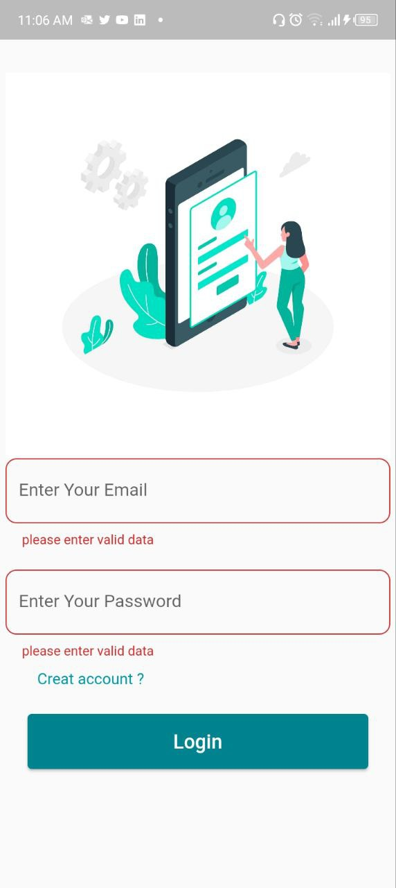
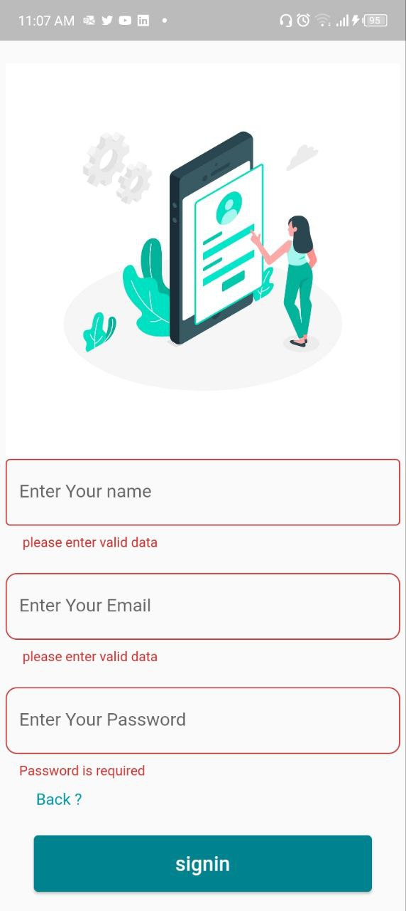

# login-signup-app

 The app contains two main pages: a login page and a signup page.  login page allows users to securely access their accounts,ensuring privacy and convenience. For new users, the signup page provides a hassle-free registration process, making it quick and easy to create an account.
 
Behind the scenes, I have employed PHP and SQL to power my robust database, managed through PHPMyAdmin. This ensures efficient storage and retrieval of user information, guaranteeing a seamless user experience.
 
Whether you're an Android or iOS user, Flutter apps can work on different platforms.  

